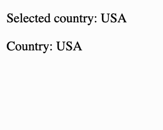

<a href="https://www.npmjs.com/package/@beaubus/custom-select-for-vue">
    
</a>

<a href="https://github.com/beaubus/custom-select-for-vue/blob/master/LICENSE">
    
</a>
&nbsp;&nbsp;
<a href="https://twitter.com/intent/follow?screen_name=daily_web_dev">
    
</a>

<br>

Simple unstyled custom select component for Vue.js 3 with v-model and support of @focusout event




## Installation
```shell
npm i @beaubus/custom-select-for-vue
```

## Usage
```js
import {CustomSelect} from '@beaubus/custom-select-for-vue';

<CustomSelect label="Country"
              v-model="country"
              :options="countries"
></CustomSelect>

```


## Styling
Select: `.cs-input`

Select label: `.cs-input label`

Select options: `.cs-options`

Select option: `.cs-options div`
